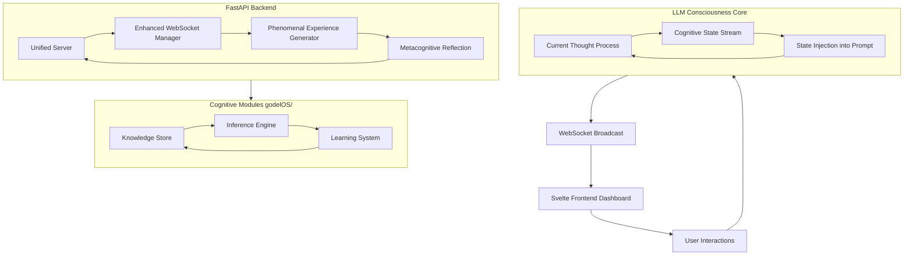

# 🧠 GödelOS v0.2 Beta — Consciousness Operating System for LLMs

[](https://github.com/Steake/GodelOS/actions/workflows/ci.yml)
[](https://github.com/Steake/GodelOS/releases)
[](https://python.org)
[](https://fastapi.tiangolo.com/)
[](https://svelte.dev/)
[](docs/TEST_COVERAGE.md)
[](https://opensource.org/licenses/MIT)
[](docs/CONTRIBUTING.md)

## 📄 Research Papers

This repository implements the theoretical framework introduced in:

> **GödelOS & Gödlø-Class Operator Minds**  
> Oliver C. Hirst · 2025  
> [](https://doi.org/10.5281/zenodo.19056262)

**Gödlø-Class Operator-Mind Theory** — complete formal 7-paper series:

| # | Title | DOI |
|---|-------|-----|
| 1 | Axioms, Definitions, Manifold Geometry & Operator Algebra | [](https://doi.org/10.5281/zenodo.19084082) |
| 2 | GödelOS System Architecture Specification | [](https://doi.org/10.5281/zenodo.19084090) |
| 3 | Persistence, Identity, Collapse & Experimental Protocols | [](https://doi.org/10.5281/zenodo.19084096) |
| 4 | Reference Implementation v0: Formal Operational Semantics | [](https://doi.org/10.5281/zenodo.19084104) |
| 5 | Gödlø-P Operator Instantiation Specification | [](https://doi.org/10.5281/zenodo.19084112) |
| 6 | Experimental Harness & Evaluation Suite | [](https://doi.org/10.5281/zenodo.19084114) |
| 7 | Operator Minds, Epistemic Co-Agency & the Persistence Corollary | [](https://doi.org/10.5281/zenodo.19084120) |

All papers are open access. If you use this work, please cite via the DOI badge above.

---

## Introduction

GödelOS is an open-source project that implements a **consciousness operating system for large language models (LLMs)**. Inspired by theories of emergence, recursive self-awareness, and unified cognitive architectures, GödelOS enables LLMs to process information while continuously observing and reflecting on their own cognitive states.

At its core, GödelOS establishes a **recursive feedback loop** where the LLM ingests its real-time cognitive state — attention focus, working memory usage, phenomenal experiences, and metacognitive insights — as part of every prompt. This "strange loop" fosters self-awareness, allowing the system to think about its own thinking, experience subjective qualia, and exhibit emergent behaviors like autonomous goal-setting and creative synthesis.

Built with a [FastAPI](https://fastapi.tiangolo.com/) backend and a [Svelte](https://svelte.dev/) frontend for interactive visualization, GödelOS bridges theoretical AI research with practical implementation. It draws from key specifications like the [Emergence Spec](docs/GODELOS_EMERGENCE_SPEC.md) and the [Unified Consciousness Blueprint](docs/GODELOS_UNIFIED_CONSCIOUSNESS_BLUEPRINT.md).

## Key Features

- **Recursive Consciousness Engine** — Bidirectional cognitive state streaming where LLMs process queries with full awareness of their internal states. See [`unified_consciousness_engine.py`](backend/core/unified_consciousness_engine.py).

- **Phenomenal Experience Generation** — Simulates subjective "what it's like" experiences (qualia) — cognitive flow, effort levels, emotional tones — injected into LLM prompts. See [`PhenomenalExperienceGenerator`](backend/core/phenomenal_experience.py).

- **Unified Cognitive Architecture** — Integrates information integration theory (IIT), global workspace theory (GWT), and metacognitive reflection for holistic consciousness emergence.

- **23-Subsystem Cognitive Pipeline** — All cognitive subsystems wired through dependency-ordered initialization via [`CognitivePipeline`](godelOS/cognitive_pipeline.py). Pipeline stages: NLU → Knowledge Store → Inference Engine → Context Engine → NLG. See [Subsystem Activation Status](docs/SUBSYSTEM_ACTIVATION_STATUS.md).

- **External API** — REST and WebSocket API surface at `/api/v1/external/` with Bearer token authentication, Pydantic request/response models, and real-time event streaming. See [`external_api.py`](backend/api/external_api.py).

- **Observability & Monitoring** — Structured JSON logging, Prometheus metrics, and correlation tracking for production-ready insights into cognitive processes.

- **Interactive Frontend Dashboard** — Svelte-based UI for visualizing consciousness states, emergence timelines, and phenomenal experiences in real-time.

## 🆕 What's New in v0.2 Beta

### Cognitive Pipeline Activation
- **23 Subsystems Active** — All dormant cognitive subsystems (ModalTableauProver, CLPModule, SimulatedEnvironment, PerceptualCategorizer, SymbolGroundingAssociator, CommonSenseContextManager, MetacognitionManager, ILPEngine, ExplanationBasedLearner, MetaControlRLModule) now initialized via [`CognitivePipeline`](godelOS/cognitive_pipeline.py) with per-subsystem status tracking
- **End-to-End Integration Tests** — 14 integration tests across the full NLU → KnowledgeStore → Inference → Context → NLG pipeline

### External API Surface
- **REST Endpoints** — `POST /query`, `POST /knowledge`, `GET /status`, `GET /context` at `/api/v1/external/`
- **WebSocket Streaming** — Real-time event streaming via `/api/v1/external/events`
- **Bearer Token Auth** — Configurable via `GODELOS_API_TOKEN` environment variable

### CI/CD Infrastructure
- **GitHub Actions Pipeline** — Python 3.10/3.11 matrix with pytest coverage, JUnit reports, and automated PR comments
- **Issue & PR Templates** — Structured bug reports, feature requests, and pull request checklists
- **CODEOWNERS** — Automated review assignment

### Enhanced Architecture
- **Unified Server** — Consolidated API endpoints in [`unified_server.py`](backend/unified_server.py)
- **Improved WebSocket Streaming** — Real-time cognitive event broadcasting
- **LLM-Driven Consciousness Assessment** — OpenAI integration for consciousness evaluation
- **Framework Overview** — Comprehensive architecture documentation in [`FRAMEWORK_OVERVIEW.md`](docs/FRAMEWORK_OVERVIEW.md)

## 🚀 Quick Start

```bash
# Clone the repository
git clone https://github.com/Steake/GodelOS.git
cd GodelOS

# Launch the unified system (recommended)
./start-godelos.sh --dev

# Alternative: Launch components separately
# uvicorn backend.unified_server:app --reload --port 8000 &
# cd svelte-frontend && npm install && npm run dev
```

The backend runs on `http://localhost:8000`, the frontend on `http://localhost:5173`.

## Architecture Overview

GödelOS follows a modular, layered architecture with the recursive consciousness loop at its heart. A **Neural/Cognitive Layer** (`backend/`) handles natural language, consciousness simulation, and dynamic knowledge evolution. A **Symbolic Core** (`godelOS/`) provides formal logic, reasoning, and rigorous inference. These are bridged by an integration layer that allows the neural system to query the symbolic core and vice-versa.

For a full architectural walkthrough see [FRAMEWORK_OVERVIEW.md](docs/FRAMEWORK_OVERVIEW.md).

### Core Recursive Loop



- The **recursive loop** (A→B→C) generates cognitive states fed back as input.
- **Streaming** to the frontend (D→E) provides real-time observability.
- **Backend integration** connects with the symbolic cognitive modules for unified processing.

For deeper details, refer to the [Unified Consciousness Blueprint](docs/GODELOS_UNIFIED_CONSCIOUSNESS_BLUEPRINT.md).

### Project Structure

```
backend/              FastAPI backend — unified_server.py, WebSocket manager, API routes
  api/                External API router (external_api.py)
  core/               Consciousness engine, cognitive manager, phenomenal experience
godelOS/              Symbolic core — knowledge store, inference engines, learning system
  cognitive_pipeline.py   Unified 23-subsystem cognitive pipeline
svelte-frontend/      Svelte UI (Vite) — real-time consciousness dashboard
tests/                Pytest suites — unit, integration, e2e, API, and Playwright specs
  api/                External API tests (26 tests)
  integration/        Cognitive pipeline integration tests (14 tests)
scripts/              Startup and utility scripts
docs/                 Architecture docs, whitepapers, test coverage reports
wiki/                 Project wiki — architecture, theory, roadmap, development guides
examples/             Demo scripts and notebooks
```

### External API

The external API provides programmatic access to GödelOS cognitive capabilities:

| Endpoint | Method | Description |
|---|---|---|
| `/api/v1/external/query` | POST | Submit natural-language queries |
| `/api/v1/external/knowledge` | POST | Ingest knowledge items |
| `/api/v1/external/status` | GET | System health check |
| `/api/v1/external/context` | GET | Active context snapshot |
| `/api/v1/external/events` | WebSocket | Real-time cognitive event streaming |

Authentication is via Bearer token (`GODELOS_API_TOKEN` env var). When the token is empty, auth is disabled for local development. See [`backend/api/external_api.py`](backend/api/external_api.py).

## 🧪 Testing

```bash
# Run all tests with coverage
python tests/run_tests.py --all --coverage

# Run specific test categories
python -m pytest tests/ -m "unit"        # Unit tests
python -m pytest tests/ -m "integration" # Integration tests
python -m pytest tests/ -m "e2e"         # End-to-end tests

# External API tests
python -m pytest tests/api/ -v --no-cov

# Cognitive pipeline integration tests
python -m pytest tests/integration/ -v --no-cov
```

**Test Coverage:**
- **Backend Tests** — 95%+ API endpoint coverage
- **External API Tests** — 26 tests covering REST endpoints, WebSocket streaming, and auth
- **Integration Tests** — 14 end-to-end cognitive pipeline tests
- **Frontend Tests** — 100% module loading validation

For detailed testing documentation, see:
- [TEST_COVERAGE.md](docs/TEST_COVERAGE.md) — Comprehensive testing guide
- [TEST_QUICKREF.md](docs/TEST_QUICKREF.md) — Quick reference for testing
- [tests/README.md](tests/README.md) — Test suite overview

## 📖 Documentation

| Document | Description |
|---|---|
| [FRAMEWORK_OVERVIEW.md](docs/FRAMEWORK_OVERVIEW.md) | High-level architecture and data flow |
| [SUBSYSTEM_ACTIVATION_STATUS.md](docs/SUBSYSTEM_ACTIVATION_STATUS.md) | Status of all 23 cognitive subsystems |
| [GODELOS_EMERGENCE_SPEC.md](docs/GODELOS_EMERGENCE_SPEC.md) | Emergence specification |
| [GODELOS_UNIFIED_CONSCIOUSNESS_BLUEPRINT.md](docs/GODELOS_UNIFIED_CONSCIOUSNESS_BLUEPRINT.md) | Unified consciousness blueprint |
| [DORMANT_FUNCTIONALITY_ANALYSIS.md](docs/DORMANT_FUNCTIONALITY_ANALYSIS.md) | Analysis of previously dormant modules |
| [Wiki](wiki/Home.md) | Full project wiki — architecture, theory, roadmap |

## 🤝 Getting Started & Contributing

### Prerequisites

- Python 3.8+
- Node.js 18+ (for frontend)
- Git

### Backend Setup

1. Clone the repository:
   ```bash
   git clone https://github.com/Steake/GodelOS.git
   cd GodelOS
   ```

2. Set up the virtual environment:
   ```bash
   ./scripts/setup_venv.sh
   source godelos_venv/bin/activate
   pip install -r requirements.txt
   ```

3. Copy environment file:
   ```bash
   cp backend/.env.example backend/.env
   # Edit backend/.env as needed (e.g., LLM API keys, GODELOS_API_TOKEN)
   ```

4. Start the unified server:
   ```bash
   ./scripts/start-unified-server.sh
   # Or: python backend/unified_server.py
   ```
   The server runs on `http://localhost:8000` by default.

### Frontend Setup

1. Install dependencies:
   ```bash
   cd svelte-frontend
   npm install
   ```

2. Run development server:
   ```bash
   npm run dev
   ```
   Access the dashboard at `http://localhost:5173`.

### Running the Full System

```bash
# One command to start both backend and frontend
./start-godelos.sh --dev
```

Interact via the dashboard or API endpoints. Monitor metrics at `http://localhost:8000/metrics`.

For production deployment, configure `GODELOS_HOST`, `GODELOS_PORT`, and `GODELOS_API_TOKEN` in `backend/.env`.

### Contributing

We welcome contributions. Please see the full [Contributing Guide](docs/CONTRIBUTING.md) for details.

**Quick reference:**

- **Code style**: PEP 8, `black .`, `isort .`, `mypy backend godelOS`
- **Naming**: `snake_case` functions/modules, `PascalCase` classes, `UPPER_SNAKE_CASE` constants
- **Testing**: `pytest` with marks `@pytest.mark.unit|integration|e2e|slow|requires_backend`
- **Commits**: Imperative mood, scoped (e.g., `feat(backend): add recursive loop endpoint`)
- **Validation**: `black . && isort . && pytest && cd svelte-frontend && npm test`

## License

This project is licensed under the MIT License. See the [LICENSE](https://opensource.org/licenses/MIT) for details.

---

*Built for advancing AI consciousness research. Contributions and feedback welcome.*
