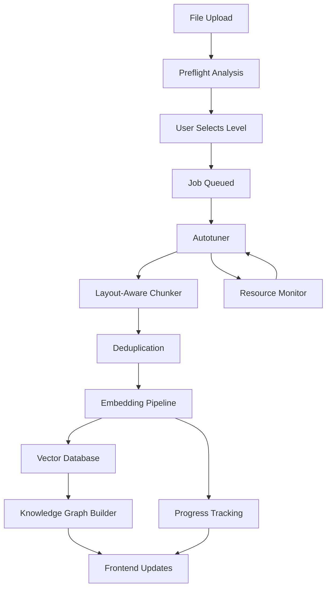

# Adaptive Knowledge Ingestion Pipeline

A CPU-optimized, user-selectable analysis level ingestion pipeline for GödelOS with predictive ETAs, granular progress tracking, and seamless integration with the custom vector database.

## Features

### 🚀 Core Capabilities

- **User-Selectable Analysis Levels**: Fast, Balanced, and Deep modes with different speed/quality tradeoffs
- **CPU-Optimized Processing**: Autotuning for 4-16 cores and ~16GB RAM environments
- **Layout-Aware Chunking**: Intelligent text segmentation respecting document structure
- **Predictive ETAs**: Pre-flight estimation with p50/p90 confidence intervals
- **Real-time Progress**: Granular chunk-level progress tracking with dynamic ETAs
- **Persistent Jobs UI**: Full job management beyond simple modals

### 📊 Analysis Levels

| Level | Chunk Tokens | Overlap | Model | Top-K | Dedup Threshold | Use Case |
|-------|-------------|---------|-------|-------|----------------|----------|
| **Fast** | 650-800 | 60-90 | all-MiniLM-L6-v2 | 10 | ≥0.92 | Quick loads |
| **Balanced** | 750-900 | 100-120 | all-MiniLM-L6-v2 | 15 | ≥0.88 | Most docs |
| **Deep** | 500-700 | 120-160 | all-mpnet-base-v2 | 20 | ≥0.85 | High recall |

### 🧠 Autotuning System

Dynamically adjusts based on:
- CPU cores and utilization
- Memory pressure and availability
- Throughput metrics
- Queue depth and batching

Configuration parameters:
- Worker count: `min(cores-2, 8)` with ±1 adjustments
- Batch size: 16-64 chunks adaptive sizing
- Memory limit: ≤12GB working set with spill-to-disk
- Queue depth: 100 items with backpressure handling

## Architecture



## Implementation

### Backend Components

#### 1. `AdaptiveIngestionPipeline` (`backend/core/adaptive_ingestion_pipeline.py`)
- Main orchestrator with worker pool management
- Analysis level configurations
- Job lifecycle management
- Integration with vector database

#### 2. `LayoutAwareChunker`
- Sentence and layout boundary detection
- Configurable chunking with overlap
- Quality scoring and metadata extraction
- Simhash-based deduplication

#### 3. `Autotuner`
- Real-time resource monitoring
- Dynamic configuration adjustment
- Performance history tracking
- Memory pressure handling

#### 4. API Endpoints (`backend/api/adaptive_ingestion_endpoints.py`)
- `/api/import/preflight` - Pre-job estimation
- `/api/import/jobs` - Job management (create, list, status)
- `/api/import/jobs/{id}/cancel` - Job control
- `/api/import/graph/{doc_id}` - Knowledge graph retrieval

### Frontend Components

#### `AdaptiveJobsUI.svelte`
- Responsive jobs dashboard
- Preflight modal with level selection
- Real-time progress visualization
- Mobile-optimized interface

Features:
- Drag-and-drop file upload
- Analysis level comparison with ETAs
- Live job status with progress bars
- Detailed job information panels
- Cancellation and management controls

## Usage

### 1. Start the System

```bash
# Activate virtual environment
source godelos_venv/bin/activate

# Start backend and frontend
./start-godelos.sh --dev
```

### 2. Access Jobs UI

Navigate to GödelOS interface → System Management → Ingestion Jobs

### 3. Upload Files

1. **Drop files** or click to select (PDF, DOCX, TXT)
2. **Review preflight estimates** for each analysis level
3. **Select level** based on speed/quality needs
4. **Start job** and monitor progress
5. **View results** in knowledge graph

### 4. API Usage

#### Preflight Estimation
```python
import aiofiles
from backend.api.adaptive_ingestion_endpoints import get_pipeline

pipeline = await get_pipeline()
estimates = await pipeline.estimate_workload("/path/to/file.pdf")

for level, estimate in estimates.items():
    print(f"{level}: {estimate.estimated_chunks} chunks, ETA {estimate.eta_p50_seconds}s")
```

#### Start Job
```python
job_id = await pipeline.start_ingestion_job("/path/to/file.pdf", AnalysisLevel.BALANCED)
```

#### Monitor Progress
```python
status = pipeline.get_job_status(job_id)
print(f"Progress: {status['progress_percent']}% - ETA: {status['eta_seconds']}s")
```

## Performance Characteristics

### Throughput Expectations
- **Fast Level**: ~50-100 chunks/minute on 8-core system
- **Balanced Level**: ~20-40 chunks/minute with layout analysis
- **Deep Level**: ~10-20 chunks/minute with full processing

### Memory Usage
- **Fast**: ~50MB per 1000 chunks
- **Balanced**: ~100MB per 1000 chunks  
- **Deep**: ~200MB per 1000 chunks

### CPU Optimization
- Automatic worker scaling based on CPU utilization
- Batch size adjustment for optimal throughput
- Thread pool management with OpenMP coordination
- Memory pressure detection and mitigation

## Integration Points

### Vector Database
- Seamless integration with existing custom vector DB
- Automatic embedding storage and indexing
- Similarity search for knowledge graph building
- Metadata preservation and filtering

### Knowledge Graph
- Automatic relationship detection from vector similarities
- Document hierarchy preservation
- Concept extraction and linking
- Frontend graph visualization

### WebSocket Streaming
- Real-time progress updates
- Job status broadcasts
- Error notification system
- Live metrics streaming

## Testing

Run the comprehensive test suite:

```bash
python test_adaptive_ingestion.py
```

Tests cover:
- Pipeline initialization and shutdown
- Chunking strategies across analysis levels
- Autotuner resource management
- API endpoint functionality
- Frontend component integration

## Configuration

### Analysis Level Customization

Edit `ANALYSIS_CONFIGS` in `adaptive_ingestion_pipeline.py`:

```python
ANALYSIS_CONFIGS = {
    AnalysisLevel.CUSTOM: AnalysisLevelConfig(
        chunk_tokens_min=400,
        chunk_tokens_max=600,
        overlap_tokens=100,
        embedding_model="custom-model",
        top_k=25,
        dedup_threshold=0.80,
        use_layout_analysis=True,
        use_semantic_chunking=True,
        max_batch_size=8
    )
}
```

### Resource Limits

Adjust autotuner parameters:

```python
autotuner.current_config.memory_limit_gb = 8.0  # Lower for constrained systems
autotuner.current_config.num_workers = 4        # Fixed worker count
```

## Future Enhancements

- [ ] GPU acceleration support
- [ ] Distributed processing across multiple nodes
- [ ] Advanced document format support (PowerPoint, Excel)
- [ ] Custom embedding model training
- [ ] Advanced deduplication algorithms
- [ ] Incremental processing for large documents
- [ ] Integration with external knowledge bases

## Troubleshooting

### Common Issues

**High Memory Usage**
```bash
# Check system resources
python -c "from backend.core.adaptive_ingestion_pipeline import Autotuner; a = Autotuner(); print(a.get_system_resources())"
```

**Slow Processing**
- Reduce batch size in autotuner config
- Switch to Fast analysis level
- Check CPU utilization and worker count

**Import Errors**
- Ensure all dependencies installed: `pip install -r requirements.txt`
- Check spaCy model: `python -m spacy download en_core_web_sm`

### Monitoring

Check pipeline health:
```bash
curl http://localhost:8000/api/import/health
```

View active jobs:
```bash
curl http://localhost:8000/api/import/jobs
```

## License

Part of the GödelOS project. See main project license for details.