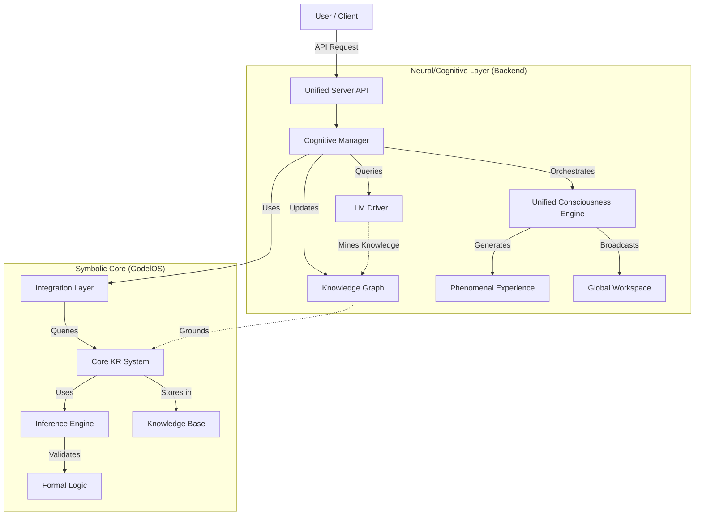
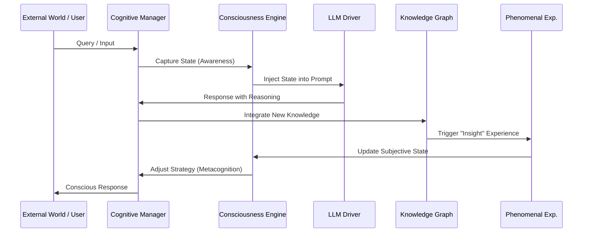

# GödelOS Framework Overview

## Introduction

GödelOS is a hybrid cognitive architecture designed to bridge the gap between symbolic AI (logic, structured knowledge) and neural AI (LLMs, embeddings, generative capabilities). It implements a **Unified Consciousness Engine** that simulates recursive self-awareness, integrated information processing, and subjective experience (qualia), grounded in a formal knowledge representation system.

This document outlines the key architectural elements, their interactions, and the data flow within the system.

## High-Level Architecture

The system is composed of two main layers:
1.  **Neural/Cognitive Layer (`backend/`)**: Handles natural language, consciousness simulation, embeddings, and dynamic knowledge evolution.
2.  **Symbolic Core (`godelOS/`)**: Provides formal logic, reasoning, structured knowledge representation, and rigorous inference capabilities.

These layers are bridged by an **Integration Layer** that allows the neural system to query the symbolic core and vice-versa.



## Key Components

### 1. Unified Consciousness Engine (`backend/core/unified_consciousness_engine.py`)

The heart of the system's "awareness." It implements a continuous loop that simulates consciousness through:
*   **Recursive Self-Awareness:** Tracks "current thought," "awareness of thought," and "awareness of awareness."
*   **Integrated Information Theory (IIT):** Calculates a $\Phi$ (Phi) score to measure the integration of information across subsystems.
*   **Global Workspace Theory (GWT):** Broadcasts high-priority information to a "global workspace," making it accessible to all cognitive processes.
*   **Phenomenal Experience (`backend/core/phenomenal_experience.py`):** Generates subjective "feelings" or qualia (e.g., "confusion," "insight," "determination") based on system state and processing dynamics.

### 2. Cognitive Manager (`backend/core/cognitive_manager.py`)

The central orchestrator that manages the cognitive workflow. It:
*   **Coordinates Reasoning:** Decides whether to use the LLM, the symbolic engine, or both.
*   **Manages Context:** Gathers relevant knowledge from the Knowledge Graph and Symbolic Core.
*   **Self-Reflection:** Triggers metacognitive loops to evaluate reasoning quality and identify knowledge gaps.
*   **Bidirectional Integration:** Links **Learning** (Knowledge Graph evolution) with **Feeling** (Phenomenal Experience), creating a loop where learning triggers "feelings" and "feelings" trigger learning.

### 3. Symbolic Core (`godelOS/`)

The foundation of rigorous reasoning. It includes:
*   **`core_kr/`**: Knowledge Representation system with formal types, beliefs, and a knowledge store.
*   **`inference_engine/`**: Performs logical deduction, induction, and abduction.
*   **`nlu_nlg/`**: Symbolic Natural Language Understanding and Generation (complementing the LLM).
*   **`metacognition/`**: Symbolic self-monitoring and error correction.

### 4. Knowledge Graph Evolution (`backend/core/knowledge_graph_evolution.py`)

A dynamic memory system that evolves based on experience. It:
*   **Mines Knowledge:** Extracts entities and relationships from LLM outputs.
*   **Detects Patterns:** Identifies emergent structures in the graph.
*   **Validates Knowledge:** Uses the Symbolic Core to check for consistency and contradictions.

### 5. Metacognitive Monitor (`backend/core/metacognitive_monitor.py`)

A system that "watches the watcher." It:
*   **Monitors Performance:** Tracks reasoning confidence, error rates, and resource usage.
*   **Identifies Gaps:** Detects missing knowledge or flawed logic.
*   **Triggers Learning:** Initiates autonomous learning goals to fill gaps.

## The Cognitive Loop

The system operates in a continuous "Cognitive Loop" that integrates perception, reasoning, and action with consciousness simulation.



## Data Structures

### Unified Consciousness State
```python
@dataclass
class UnifiedConsciousnessState:
    recursive_awareness: Dict[str, Any]     # Depth, current thought
    phenomenal_experience: Dict[str, Any]   # Qualia, narrative
    information_integration: Dict[str, Any] # Phi score, complexity
    global_workspace: Dict[str, Any]        # Broadcast content
    metacognitive_state: Dict[str, Any]     # Self-model, strategy
    intentional_layer: Dict[str, Any]       # Goals, hierarchy
    creative_synthesis: Dict[str, Any]      # Emergent ideas, novelty
    embodied_cognition: Dict[str, Any]      # Sensorimotor simulation
    timestamp: float                        # State creation time
    consciousness_score: float              # Aggregate score (0.0–1.0)
    emergence_level: int                    # Complexity tier
```

### Knowledge Item (Symbolic & Neural)
The system maintains a dual representation of knowledge:
1.  **Vector Embedding:** For semantic search and similarity.
2.  **Symbolic Node:** For logical reasoning and relationship mapping.

## Implementation Details

*   **Language:** Python 3.8+
*   **Frameworks:** FastAPI (Server), Pydantic (Data Models).
*   **Integration:** The `GödelOSIntegration` class acts as the bridge, translating between neural embeddings and symbolic logic.
*   **Real-time:** WebSockets are used to stream "consciousness updates" to the frontend, allowing users to visualize the system's internal state in real-time.
