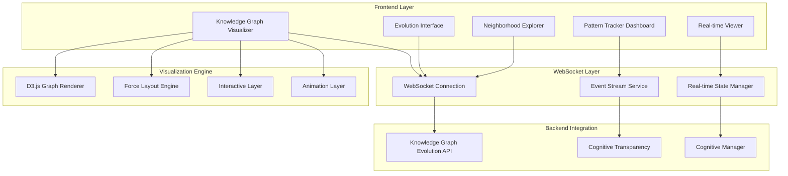

# 🧠 GödelOS Knowledge Graph Evolution Frontend Integration Specification

## Executive Summary

This specification defines the comprehensive frontend integration for visualizing and interacting with the Knowledge Graph Evolution system within the GödelOS Svelte interface. The solution provides real-time visualization of dynamic knowledge structures, interactive exploration capabilities, and seamless integration with the cognitive transparency framework.

## System Architecture



## Component Specifications

### 1. Knowledge Graph Visualizer Component

#### 1.1 Core Functionality
- **Real-time graph rendering** using D3.js force-directed layout
- **Interactive node manipulation** with drag, zoom, and selection
- **Dynamic edge visualization** with strength-based styling
- **Multi-layered view modes** (overview, detail, focus)
- **Responsive design** adapting to different screen sizes

#### 1.2 Technical Implementation
```typescript
interface KnowledgeGraphVisualizerProps {
  graphData: GraphData;
  viewMode: 'overview' | 'detail' | 'focus';
  interactionMode: 'explore' | 'edit' | 'analyze';
  evolutionSpeed: number;
  showEvolutionHistory: boolean;
  filterCriteria: FilterCriteria;
}

interface GraphData {
  nodes: KnowledgeNode[];
  edges: KnowledgeEdge[];
  metadata: GraphMetadata;
  evolutionEvents: EvolutionEvent[];
}
```

#### 1.3 Visual Design Specifications
- **Node Styling**:
  - Size: Based on activation strength (10-50px radius)
  - Color: Concept type mapping (blue=theoretical, green=computational, etc.)
  - Border: Status indication (solid=stable, dashed=emerging, dotted=evolving)
  - Glow effect: For recently evolved concepts

- **Edge Styling**:
  - Width: Relationship strength (1-8px)
  - Color: Relationship type mapping
  - Style: Solid/dashed/dotted based on confidence
  - Animation: Flow particles for active relationships

### 2. Evolution Interface Component

#### 2.1 Evolution Trigger Panel
```typescript
interface EvolutionTriggerPanel {
  availableTriggers: EvolutionTrigger[];
  customTriggerBuilder: TriggerBuilder;
  triggerHistory: TriggerHistory[];
  realTimeMonitoring: boolean;
}

interface EvolutionTrigger {
  type: TriggerType;
  name: string;
  description: string;
  parameters: TriggerParameters;
  confidence: number;
  lastUsed: timestamp;
}
```

#### 2.2 Evolution Controls
- **Manual trigger buttons** for each evolution type
- **Parameter adjustment sliders** for trigger sensitivity
- **Context input fields** for providing evolution context
- **Batch evolution controls** for multiple triggers
- **Evolution speed controls** for animation timing

#### 2.3 Evolution History Viewer
- **Timeline visualization** of evolution events
- **Before/after graph comparisons**
- **Evolution impact metrics** display
- **Rollback capabilities** for testing scenarios

### 3. Pattern Tracker Dashboard

#### 3.1 Pattern Detection Interface
```typescript
interface PatternTrackerProps {
  detectedPatterns: EmergentPattern[];
  patternTypes: PatternType[];
  confidenceThreshold: number;
  realTimeDetection: boolean;
  patternHistory: PatternHistory[];
}

interface EmergentPattern {
  id: string;
  type: PatternType;
  confidence: number;
  involvedConcepts: string[];
  emergenceContext: string;
  discoveryTimestamp: timestamp;
  significance: number;
}
```

#### 3.2 Pattern Visualization
- **Pattern overlay system** on main graph
- **Pattern confidence indicators** with color coding
- **Pattern emergence animations** showing formation
- **Pattern relationship mapping** between different patterns

#### 3.3 Pattern Analytics
- **Pattern frequency analysis** over time
- **Pattern correlation matrices**
- **Pattern prediction algorithms** based on graph state
- **Pattern significance scoring** and ranking

### 4. Neighborhood Explorer Component

#### 4.1 Focused Exploration Interface
```typescript
interface NeighborhoodExplorerProps {
  centerConcept: string;
  explorationDepth: number;
  neighborhoodData: NeighborhoodData;
  pathHighlighting: boolean;
  conceptDetails: ConceptDetails;
}

interface NeighborhoodData {
  centerNode: KnowledgeNode;
  neighbors: NeighborNode[];
  paths: ConceptPath[];
  metrics: NeighborhoodMetrics;
}
```

#### 4.2 Interactive Features
- **Click-to-explore** concept navigation
- **Depth control slider** (1-5 levels)
- **Path highlighting** between concepts
- **Relationship strength filtering**
- **Concept detail panels** with rich information

### 5. Real-time Evolution Viewer

#### 5.1 Live Update System
```typescript
interface RealTimeViewer {
  websocketConnection: WebSocketConnection;
  evolutionStream: EvolutionEventStream;
  animationQueue: AnimationQueue;
  updateBuffer: UpdateBuffer;
}

interface EvolutionEventStream {
  conceptUpdates: ConceptUpdate[];
  relationshipChanges: RelationshipChange[];
  patternEmergence: PatternEmergence[];
  graphMetrics: GraphMetrics;
}
```

#### 5.2 Animation System
- **Smooth transitions** for graph changes
- **Particle effects** for evolution events
- **Glow animations** for new concepts
- **Pulse effects** for relationship changes
- **Morphing animations** for concept evolution

## Data Models

### Knowledge Graph Data Structure
```typescript
interface KnowledgeNode {
  id: string;
  name: string;
  description: string;
  conceptType: ConceptType;
  activationStrength: number;
  status: NodeStatus;
  attributes: ConceptAttributes;
  position: Position;
  metadata: NodeMetadata;
  evolutionHistory: EvolutionHistory[];
}

interface KnowledgeEdge {
  id: string;
  sourceId: string;
  targetId: string;
  relationshipType: RelationshipType;
  strength: number;
  confidence: number;
  attributes: RelationshipAttributes;
  metadata: EdgeMetadata;
  evolutionHistory: EvolutionHistory[];
}

interface GraphMetadata {
  totalConcepts: number;
  totalRelationships: number;
  graphDensity: number;
  averageDegree: number;
  connectedComponents: number;
  evolutionGeneration: number;
  lastEvolutionTime: timestamp;
}
```

### Evolution Event Models
```typescript
interface EvolutionEvent {
  id: string;
  trigger: EvolutionTrigger;
  timestamp: timestamp;
  changesMade: EvolutionChanges;
  validationScore: number;
  impactMetrics: ImpactMetrics;
  context: EvolutionContext;
}

interface EvolutionChanges {
  conceptsAdded: KnowledgeNode[];
  conceptsModified: ConceptModification[];
  conceptsRemoved: string[];
  relationshipsAdded: KnowledgeEdge[];
  relationshipsModified: RelationshipModification[];
  relationshipsRemoved: string[];
  patternsDetected: EmergentPattern[];
}
```

## API Contracts

### WebSocket Event Types
```typescript
// Outgoing Events (Frontend → Backend)
interface WSOutgoingEvents {
  'kg:subscribe': { filters: SubscriptionFilters };
  'kg:trigger_evolution': { trigger: EvolutionTrigger; context: any };
  'kg:request_neighborhood': { conceptId: string; depth: number };
  'kg:detect_patterns': { patternTypes: PatternType[]; threshold: number };
  'kg:update_filters': { filters: GraphFilters };
}

// Incoming Events (Backend → Frontend)
interface WSIncomingEvents {
  'kg:graph_update': { graphData: GraphData };
  'kg:evolution_event': { event: EvolutionEvent };
  'kg:pattern_detected': { pattern: EmergentPattern };
  'kg:neighborhood_data': { neighborhood: NeighborhoodData };
  'kg:metrics_update': { metrics: GraphMetrics };
}
```

### REST API Integration
```typescript
interface KGVisualizationAPI {
  // Graph Data
  getGraphData(): Promise<GraphData>;
  getGraphSummary(): Promise<GraphSummary>;
  
  // Evolution Management
  triggerEvolution(trigger: EvolutionTrigger): Promise<EvolutionResult>;
  getEvolutionHistory(limit?: number): Promise<EvolutionEvent[]>;
  
  // Pattern Analysis
  detectPatterns(criteria: PatternCriteria): Promise<EmergentPattern[]>;
  getPatternHistory(): Promise<PatternHistory>;
  
  // Neighborhood Exploration
  getNeighborhood(conceptId: string, depth: number): Promise<NeighborhoodData>;
  getConceptDetails(conceptId: string): Promise<ConceptDetails>;
}
```

## Implementation Notes

### 1. Performance Optimization

#### Graph Rendering Performance
- **Level-of-detail rendering** for large graphs (>1000 nodes)
- **Viewport culling** to render only visible elements
- **Batched updates** for real-time changes
- **Web Workers** for heavy graph calculations
- **Canvas fallback** for very large datasets

#### Memory Management
```typescript
interface PerformanceConfig {
  maxVisibleNodes: number; // Default: 500
  maxHistoryEvents: number; // Default: 100
  updateThrottleMs: number; // Default: 16ms (60fps)
  animationDuration: number; // Default: 1000ms
  useWebGL: boolean; // For large graphs
}
```

#### Update Strategies
- **Incremental updates** for small changes
- **Full refresh** for major evolution events
- **Debounced updates** to prevent rapid flickering
- **Priority queuing** for critical vs. cosmetic updates

### 2. Accessibility Considerations

#### Screen Reader Support
- **ARIA labels** for all interactive elements
- **Semantic HTML structure** for graph navigation
- **Keyboard navigation** for all graph interactions
- **Focus management** for complex UI states

#### Visual Accessibility
- **High contrast mode** support
- **Colorblind-friendly** color schemes
- **Scalable text** and UI elements
- **Motion reduction** options for animations

### 3. Responsive Design Strategy

#### Breakpoint System
```scss
// Mobile First Approach
$mobile: 320px;
$tablet: 768px;
$desktop: 1024px;
$large: 1440px;

.kg-visualizer {
  // Mobile: Simplified view
  @media (max-width: $tablet) {
    .detail-panel { display: none; }
    .graph-container { height: 60vh; }
  }
  
  // Tablet: Moderate detail
  @media (min-width: $tablet) {
    .detail-panel { width: 25%; }
    .graph-container { height: 70vh; }
  }
  
  // Desktop: Full feature set
  @media (min-width: $desktop) {
    .detail-panel { width: 30%; }
    .graph-container { height: 80vh; }
  }
}
```

#### Touch Optimization
- **Touch-friendly** node sizes (minimum 44px tap targets)
- **Gesture support** for zoom and pan
- **Touch feedback** with haptic responses
- **Swipe navigation** for mobile interfaces

### 4. State Management Integration

#### Svelte Stores Integration
```typescript
// Core Knowledge Graph Store
export const knowledgeGraphStore = writable<GraphData>({
  nodes: [],
  edges: [],
  metadata: initialMetadata,
  evolutionEvents: []
});

// Evolution State Store
export const evolutionStore = writable<EvolutionState>({
  isEvolving: false,
  currentTrigger: null,
  evolutionQueue: [],
  lastEvolution: null
});

// Pattern Detection Store
export const patternStore = writable<PatternState>({
  detectedPatterns: [],
  activePattern: null,
  detectionThreshold: 0.6,
  realTimeDetection: true
});

// UI State Store
export const kgUIStore = writable<KGUIState>({
  viewMode: 'overview',
  selectedNodes: [],
  selectedEdges: [],
  showEvolutionHistory: false,
  animationsEnabled: true
});
```

#### Store Synchronization
- **Bidirectional sync** with backend via WebSocket
- **Optimistic updates** for better UX
- **Conflict resolution** for concurrent modifications
- **State persistence** for session continuity

## Risk Analysis

### Technical Risks

#### Performance Risks
- **Large graph rendering** may cause browser lag
- **Real-time updates** could overwhelm the UI
- **Memory leaks** from complex D3.js interactions
- **Battery drain** on mobile devices

**Mitigation Strategies:**
- Implement progressive rendering with virtualization
- Use throttling and debouncing for updates
- Proper cleanup of D3.js event listeners
- Power-efficient animation strategies

#### Integration Risks
- **WebSocket connection** instability
- **API response time** variability
- **Data synchronization** conflicts
- **Browser compatibility** issues

**Mitigation Strategies:**
- Robust reconnection logic for WebSocket
- Fallback to polling for API calls
- Conflict resolution algorithms
- Progressive enhancement approach

### User Experience Risks

#### Cognitive Overload
- **Information density** may overwhelm users
- **Complex interactions** could confuse non-experts
- **Real-time changes** might be disorienting

**Mitigation Strategies:**
- Layered information disclosure
- Guided tours and onboarding
- Animation control and pause options

#### Accessibility Barriers
- **Visual-only** information presentation
- **Complex gestures** difficult for some users
- **Rapid animations** problematic for vestibular disorders

**Mitigation Strategies:**
- Multi-modal information presentation
- Alternative interaction methods
- User-controlled animation preferences

## Success Metrics

### Technical Performance
- **Graph rendering time**: < 200ms for 500 nodes
- **Update latency**: < 50ms for real-time changes
- **Memory usage**: < 100MB for typical sessions
- **Frame rate**: Maintain 60fps during animations

### User Experience
- **Task completion rate**: > 90% for basic operations
- **Time to insight**: < 30 seconds to understand graph structure
- **User satisfaction**: > 4.5/5 in usability testing
- **Accessibility compliance**: WCAG 2.1 AA level

### System Integration
- **WebSocket uptime**: > 99.5%
- **Data synchronization accuracy**: > 99.9%
- **Cross-browser compatibility**: Support for 95% of users
- **Mobile responsiveness**: Full functionality on tablets+

## Conclusion

This Knowledge Graph Evolution Frontend Integration provides a comprehensive solution for visualizing and interacting with the dynamic cognitive architecture of GödelOS. The specification ensures scalability, accessibility, and seamless integration with the existing cognitive transparency framework while maintaining high performance and user experience standards.

The implementation will create an intuitive interface for understanding how the AI's knowledge structures evolve in real-time, providing unprecedented transparency into the cognitive processes of an artificial intelligence system.