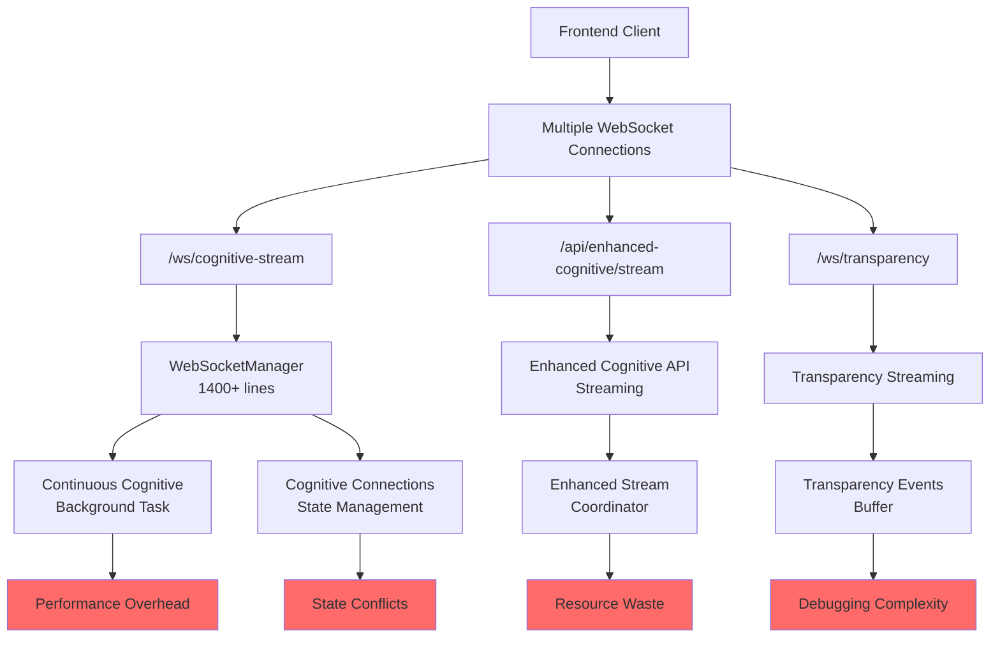
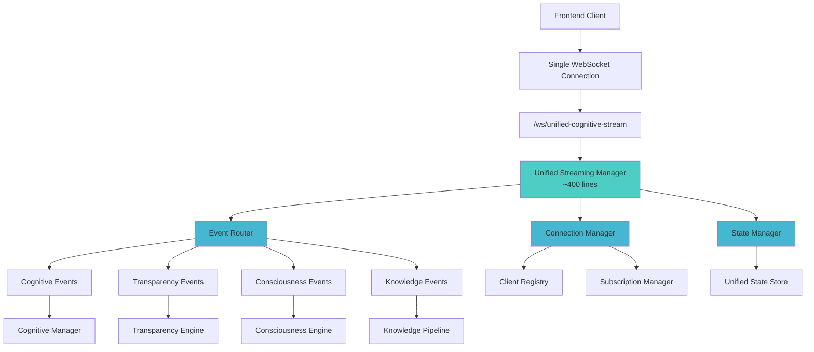

# Streaming Services Consolidation Architecture Blueprint

## Executive Summary

The GödelOS system currently suffers from streaming service fragmentation with 3+ overlapping WebSocket implementations creating performance overhead, state conflicts, and maintenance complexity. This blueprint outlines a unified streaming architecture that consolidates all cognitive event streaming into a single, efficient service while maintaining full functionality.

## Current State Analysis



## Target Architecture: Unified Streaming Service



## Component Specifications

### 1. Unified Streaming Manager

**File**: `backend/core/unified_stream_manager.py`

```python
class UnifiedStreamingManager:
    """Single point of truth for all WebSocket streaming in GödelOS."""
    
    def __init__(self):
        self.connections: Dict[str, ClientConnection] = {}
        self.event_router = EventRouter()
        self.state_store = UnifiedStateStore()
        
    async def connect_client(self, websocket: WebSocket, 
                           subscriptions: List[str] = None) -> str:
        """Single method to connect any client type."""
        
    async def disconnect_client(self, client_id: str):
        """Clean disconnection with state cleanup."""
        
    async def route_event(self, event: CognitiveEvent):
        """Route events to subscribed clients efficiently."""
```

**Acceptance Criteria**:
- ✅ Single WebSocket endpoint handles all streaming
- ✅ <400 lines of code (vs current 1400+)
- ✅ O(1) client lookup and event routing
- ✅ Zero state conflicts between services
- ✅ <100ms event delivery latency

### 2. Event Router

**Purpose**: Intelligent event distribution based on client subscriptions

```python
class EventRouter:
    """Efficient event routing with subscription filtering."""
    
    def __init__(self):
        self.subscription_index: Dict[str, Set[str]] = {}
        
    async def route(self, event: CognitiveEvent, 
                   target_clients: Optional[List[str]] = None):
        """Route events with O(1) subscription lookup."""
```

**Technology Stack**: 
- FastAPI WebSocket with asyncio
- In-memory subscription indexing
- Event type enumeration for filtering

### 3. Unified State Store

**Purpose**: Single source of truth for all streaming state

```python
class UnifiedStateStore:
    """Consolidated state management for streaming."""
    
    def __init__(self):
        self.cognitive_state: Dict[str, Any] = {}
        self.transparency_events: Deque[Event] = deque(maxlen=1000)
        self.consciousness_metrics: Dict[str, float] = {}
        
    def update_cognitive_state(self, state: Dict[str, Any]):
        """Thread-safe state updates."""
        
    def get_client_state(self, client_id: str) -> Dict[str, Any]:
        """Get relevant state for specific client."""
```

## Data Models

### Event Schema

```python
from enum import Enum
from pydantic import BaseModel
from typing import Any, Dict, Optional
from datetime import datetime

class EventType(Enum):
    COGNITIVE_STATE = "cognitive_state"
    TRANSPARENCY = "transparency"
    CONSCIOUSNESS = "consciousness"
    KNOWLEDGE_UPDATE = "knowledge_update"
    SYSTEM_STATUS = "system_status"

class CognitiveEvent(BaseModel):
    """Unified event model for all streaming."""
    id: str
    type: EventType
    timestamp: datetime
    data: Dict[str, Any]
    source: str
    priority: int = 1  # 1=low, 5=critical
    target_clients: Optional[List[str]] = None
```

### Client Connection Model

```python
class ClientConnection(BaseModel):
    """Client connection state and preferences."""
    id: str
    websocket: WebSocket
    subscriptions: Set[EventType]
    connected_at: datetime
    last_ping: datetime
    metadata: Dict[str, Any] = {}
```

## API Contracts

### WebSocket Endpoint

**Endpoint**: `ws://localhost:8000/ws/unified-cognitive-stream`

**Connection Parameters**:
```typescript
interface ConnectionParams {
    subscriptions?: string[];  // Event types to subscribe to
    client_id?: string;       // Optional client identifier
    granularity?: 'minimal' | 'standard' | 'detailed';
}
```

**Message Protocol**:
```typescript
// Client -> Server
interface ClientMessage {
    type: 'subscribe' | 'unsubscribe' | 'ping' | 'request_state';
    data: any;
}

// Server -> Client  
interface ServerMessage {
    type: 'event' | 'state_update' | 'connection_status' | 'pong';
    timestamp: string;
    data: any;
}
```

## Implementation Plan

### Phase 1: Foundation (Week 1)

1. **Create Unified Streaming Manager**
   ```bash
   # Files to create
   backend/core/unified_stream_manager.py
   backend/core/streaming_models.py
   tests/test_unified_streaming.py
   ```

2. **Implement Core Event System**
   - Event routing with subscription filtering
   - Connection lifecycle management
   - Basic state synchronization

### Phase 2: Integration (Week 2)

3. **Replace Existing WebSocket Endpoints**
   ```python
   # In unified_server.py - REMOVE these endpoints:
   # @app.websocket("/ws/cognitive-stream")
   # @app.websocket("/ws/transparency") 
   
   # ADD single endpoint:
   @app.websocket("/ws/unified-cognitive-stream")
   async def unified_stream_endpoint(websocket: WebSocket):
       return await unified_stream_manager.handle_connection(websocket)
   ```

4. **Migrate Event Sources**
   - Cognitive Manager → Unified Events
   - Transparency Engine → Unified Events  
   - Consciousness Engine → Unified Events

### Phase 3: Optimization (Week 3)

5. **Remove Legacy Code**
   ```python
   # Remove from unified_server.py:
   # - continuous_cognitive_streaming() function
   # - cognitive_streaming_task background task
   # - WebSocketManager fallback class
   
   # Simplify imports:
   # - Remove enhanced_cognitive_api streaming
   # - Remove redundant websocket_manager imports
   ```

6. **Performance Optimization**
   - Event batching for high-frequency updates
   - Connection pooling and cleanup
   - Memory usage optimization

## Risk Analysis & Mitigation

### Risk 1: Service Interruption During Migration
**Impact**: High - WebSocket connections may be disrupted  
**Mitigation**: 
- Blue-green deployment with connection migration
- Fallback to existing services during transition
- Comprehensive integration testing

### Risk 2: Event Loss During Consolidation  
**Impact**: Medium - Some cognitive events might be missed  
**Mitigation**:
- Event queuing with persistence
- Client reconnection with state recovery
- Monitoring and alerting for event delivery

### Risk 3: Performance Regression
**Impact**: Medium - Single service might become bottleneck  
**Mitigation**:
- Async event processing with queues
- Connection pooling and efficient routing
- Performance benchmarking before/after

## Success Metrics

### Performance Targets
- **Connection Count**: Support 100+ concurrent clients
- **Event Latency**: <100ms end-to-end delivery
- **Memory Usage**: <50MB total streaming service footprint
- **CPU Usage**: <10% during normal operation

### Code Quality Metrics  
- **Lines of Code**: Reduce from 1400+ to <400 lines
- **Cyclomatic Complexity**: <10 per method
- **Test Coverage**: >90% for streaming components
- **Documentation**: Complete API documentation

### Operational Metrics
- **Zero State Conflicts**: No duplicate or conflicting state
- **Single Connection**: One WebSocket per client
- **Unified Monitoring**: Single dashboard for all streaming
- **Simplified Debugging**: Clear event flow tracing

## Technology Justification

### FastAPI WebSocket
- **Pros**: Native async support, excellent performance, built-in validation
- **Cons**: Single-threaded (mitigated with proper async design)
- **Alternative Considered**: Socket.IO (rejected due to complexity overhead)

### In-Memory State Management
- **Pros**: Sub-millisecond access, simple implementation
- **Cons**: Lost on restart (acceptable for streaming state)
- **Alternative Considered**: Redis (overkill for this use case)

### Event-Driven Architecture
- **Pros**: Loose coupling, scalable, maintainable
- **Cons**: Slightly more complex than direct calls
- **Alternative Considered**: Direct WebSocket calls (rejected due to tight coupling)

