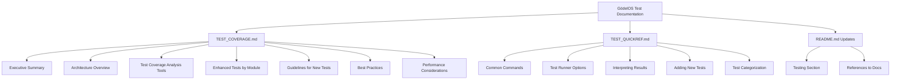
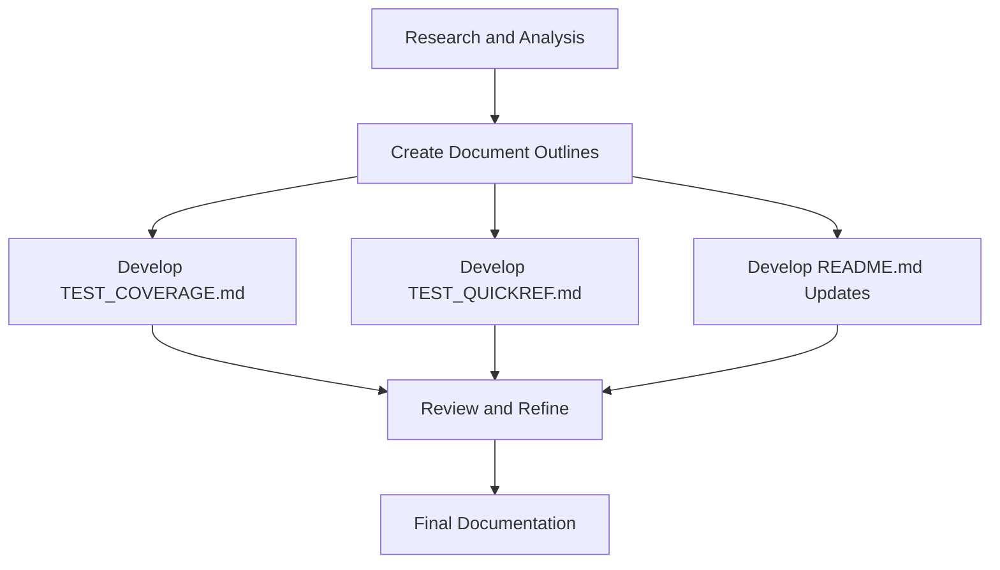

Based on my analysis of the GödelOS project and its testing infrastructure, I've developed the following plan for creating the test coverage documentation. Does this meet your requirements?

# Detailed Plan for GödelOS Test Coverage Documentation

This plan outlines the structure and content for each of the three deliverables: TEST_COVERAGE.md, TEST_QUICKREF.md, and updates to README.md.

## Documentation Overview

## 1. TEST_COVERAGE.md

This will be the comprehensive documentation file that provides detailed information about the test coverage implementation.

### Structure and Content

#### 1.1 Executive Summary
- Brief overview of the test coverage implementation
- Key features and benefits
- High-level architecture diagram
- Summary of test coverage metrics and achievements

#### 1.2 Architecture Overview of Test Suite Runner
- Detailed explanation of the test suite runner architecture
- Component diagram showing relationships between key components
- Explanation of data flow through the system
- Key interfaces and classes

#### 1.3 Test Coverage Analysis Tools
- Description of test_coverage_analyzer.py
- Description of method_coverage_analyzer.py
- Description of generate_coverage_report.py
- Description of run_test_coverage_analysis.sh

#### 1.4 Enhanced Tests by Module
- Summary of enhanced tests for each module, organized by phase:
  - Phase 1: Symbol Grounding, Common Sense, and Ontology
  - Phase 2: Core Knowledge Representation and Inference Engine
  - Phase 3: Metacognition, NLU/NLG, and Scalability

#### 1.5 Guidelines for Writing New Tests
- Test file naming conventions
- Test structure and organization
- Using pytest fixtures and markers
- Writing effective assertions
- Handling test dependencies
- Mocking and stubbing techniques

#### 1.6 Best Practices for Maintaining and Extending Test Coverage
- Regular test coverage analysis
- Continuous integration considerations
- Updating tests when refactoring code
- Documentation standards for tests

#### 1.7 Performance Considerations
- Optimizing test execution time
- Parallel test execution
- Test categorization for selective testing
- Resource management during testing

## 2. TEST_QUICKREF.md

This will be a concise reference guide that provides quick access to common testing commands and procedures.

### Structure and Content

#### 2.1 Common Commands for Running Tests
- Basic test execution commands
- Running specific test categories
- Running tests for specific modules

#### 2.2 Test Runner Options and Examples
- Configuration options
- Command-line arguments
- Examples of common usage patterns

#### 2.3 Interpreting Test Results and Reports
- Understanding console output
- Reading HTML reports
- Analyzing JSON reports

#### 2.4 Adding New Tests to the System
- Quick guide to creating new test files
- Template for test classes and methods
- Required imports and setup

#### 2.5 Test Categorization Guide
- Available test categories
- How to assign tests to categories
- Using pytest markers

## 3. README.md Updates

### Structure and Content

#### 3.1 Testing Section
- Brief overview of the testing approach
- Key features of the test infrastructure
- Test coverage summary
- How to run tests

#### 3.2 References to Documentation
- Links to TEST_COVERAGE.md and TEST_QUICKREF.md
- Brief description of what each document contains

## Implementation Approach

