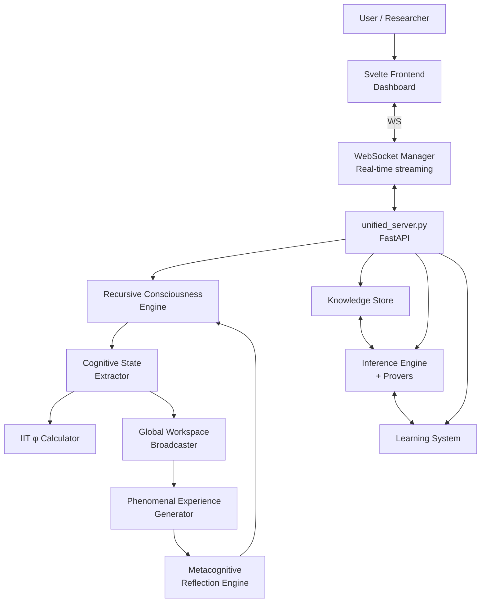

# System Overview

Architecture, it has been observed, is frozen music; and there is something to the analogy when applied to software — a well-designed system has a coherence, an internal logic, that one can hear if one listens carefully enough. GödelOS is, by this standard, a fairly ambitious composition: a FastAPI backend conducting a recursive consciousness loop, broadcasting cognitive state over WebSockets to a Svelte frontend that visualises, in real time, the system thinking about itself thinking.

One might object that this is merely a very elaborate feedback loop. One would not be entirely wrong; but one would be missing the point in rather the same way that a man who describes *Hamlet* as "a play about a prince who can't make up his mind" is technically accurate and practically useless.

---

## The Architecture at Large

---

## Directory Structure

The codebase is, mercifully, organised with some intelligence. Each directory has a purpose; and — unlike certain other open-source projects that shall remain nameless — that purpose is documented.

| Path | Purpose |
|------|---------|
| `backend/` | FastAPI application, unified server, WebSocket management |
| `backend/core/` | The consciousness engine proper — the beating heart |
| `svelte-frontend/` | Real-time dashboard; what the outside world sees |
| `godelOS/` | The cognitive modules: knowledge, inference, learning |
| `tests/` | 1,299 tests, now collectible without error |
| `docs/` | Whitepapers, architecture specifications, analysis |
| `wiki/` | What you are presently reading |

---

## Key Entry Points

| File | Role |
|------|------|
| `backend/unified_server.py` | FastAPI application root; all routes; startup wiring |
| `backend/core/unified_consciousness_engine.py` | The master consciousness loop |
| `backend/core/phenomenal_experience.py` | Qualia generation — the system's subjective "what it is like" |
| `svelte-frontend/src/App.svelte` | UI root |
| `godelOS/` | Symbolic reasoning, knowledge stores, learning subsystems |

---

## Runtime Ports

| Service | Port |
|---------|------|
| FastAPI backend | 8000 |
| WebSocket consciousness stream | 8000/ws |
| Svelte development server | 5173 |
| Prometheus metrics | 8000/metrics |

The system runs on a single machine with no Docker requirement — a design decision that has saved an unknowable quantity of human suffering.
