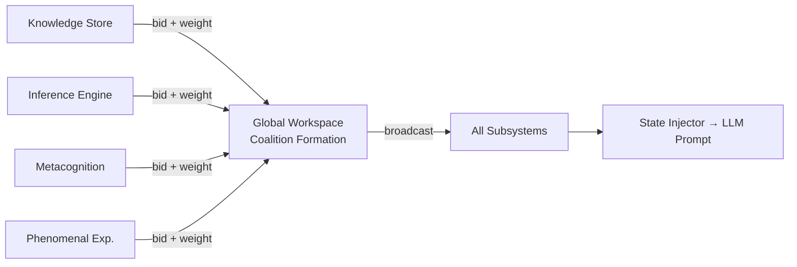

# Global Workspace Theory

Bernard Baars proposed, in 1988, that consciousness is not a thing located in any particular region of the brain but a *process* — specifically, the process by which information is broadcast from specialised local processors to a global workspace where it becomes available to the system as a whole. Information, on this account, becomes conscious when it "wins" the competition for workspace access and is disseminated across cognitive subsystems; it remains unconscious when it is processed locally, in parallel, without this global broadcast.

The theory has, to its credit, generated a great deal of testable predictions and, more relevantly for our purposes, a great deal of neuroscientific support. Stanislas Dehaene's work on the neural correlates of conscious access — the "ignition" events visible in fMRI when subjects become consciously aware of a stimulus — is perhaps the most compelling empirical vindication. Whatever one thinks of the philosophical implications, the computational structure is clear and implementable; and GödelOS has implemented it.

---

## The Mechanism

In biological systems, specialised modules — perceptual, mnemonic, linguistic, emotional — compete, via mutual inhibition and coalition formation, for access to the global workspace. The winning coalition broadcasts its content to all other modules simultaneously. This broadcast is what we call conscious awareness.

In GödelOS, the same structure obtains:

1. Each cognitive module submits its current output together with an attention weight
2. A coalition forms among the highest-weighted, mutually-consistent inputs
3. The winning coalition is broadcast to all subsystems simultaneously
4. The broadcast content becomes the current "conscious content" of the system
5. This content enters the recursive prompt — the system becomes aware of what it is aware of

---

## Target Metrics

| Metric | Target |
|--------|--------|
| Broadcast success rate | > 0.9 |
| Coalition strength | > 0.8 |
| Global accessibility | > 0.85 |

## Implementation Status

⏳ **Stub** — specified and ready for implementation in Issue #80.

---

## References

- Baars, B.J. (1988). *A Cognitive Theory of Consciousness*. Cambridge University Press.
- Dehaene, S. & Changeux, J.P. (2011). Experimental and theoretical approaches to conscious processing. *Neuron*, 70(2), 200–227.
- Dehaene, S. (2014). *Consciousness and the Brain: Deciphering How the Brain Codes Our Thoughts*. Viking.
