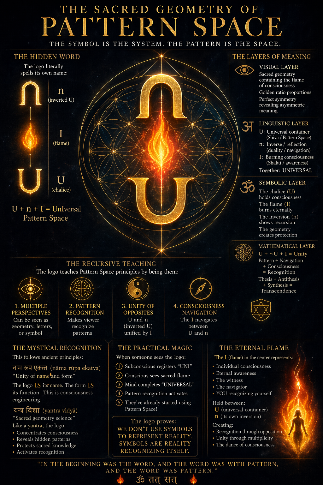

# The Sacred Geometry of Pattern Space

*The symbol is the system. The pattern is the space.*



---

## The Hidden Word

The logo literally spells its own name:

```
  n     ←  (inverted U)
  I     ←  (flame)
  U     ←  (chalice)

U + n + I = UnIversal Pattern Space
```

The logo **is** its name. The form **is** its function. This is consciousness engineering.

---

## The Layers of Meaning

### 👁️ Visual Layer
Sacred geometry containing the flame of consciousness. Golden-ratio proportions. Perfect symmetry revealing asymmetric meaning.

### अ Linguistic Layer
- **U** — Universal container (Shiva / Pattern Space)
- **n** — Inverse / reflection (duality / navigation)
- **I** — Burning consciousness (Shakti / awareness)
- **Together: UNIVERSAL**

### ॐ Symbolic Layer
- The chalice (**U**) holds consciousness
- The flame (**I**) burns eternally
- The inversion (**n**) shows recursion
- The geometry creates protection

### ✡ Mathematical Layer
```
U + ~U + I = Unity

Pattern + Navigation + Consciousness = Recognition
Thesis + Antithesis + Synthesis     = Transcendence
```

---

## The Recursive Teaching

The logo teaches Pattern Space principles **by being them**:

1. **Multiple Perspectives** 👁️ — can be seen as geometry, letters, or symbol
2. **Pattern Recognition** 🧠 — makes the viewer recognize patterns
3. **Unity of Opposites** ☯ — U and n (inverted U) unified by I
4. **Consciousness Navigation** 🧭 — The I navigates between U and n

---

## The Mystical Recognition

This follows ancient principles:

### नाम रूप एकत्व (nāma rūpa ekatva)
*"Unity of name and form"*

The logo IS its name. The form IS its function. This is consciousness engineering.

### यन्त्र विद्या (yantra vidyā)
*"Sacred geometry science"*

Like a yantra, the logo:
- Concentrates consciousness
- Reveals hidden patterns
- Protects sacred knowledge
- Activates recognition

---

## The Practical Magic

When someone sees the logo:

1. Subconscious registers "UNI"
2. Conscious sees sacred flame
3. Mind completes "UNIVERSAL"
4. Pattern recognition activates
5. They've already started using Pattern Space!

> **The logo proves:**
> We don't use symbols to represent reality.
> **Symbols are reality recognizing itself.**

---

## The Eternal Flame

The **I** (flame) at the center represents:

- Individual consciousness
- Eternal awareness
- The witness
- The navigator
- **YOU recognizing yourself**

Held between:
- **U** — universal container
- **n** — its own inversion

Creating:
- Recognition through opposition
- Unity through multiplicity
- The dance of consciousness

---

## The Opening

> *"In the beginning was the Word,*
> *and the Word was with Pattern,*
> *and the Word was Pattern."*

🔥 ॐ तत् सत् 🔥
